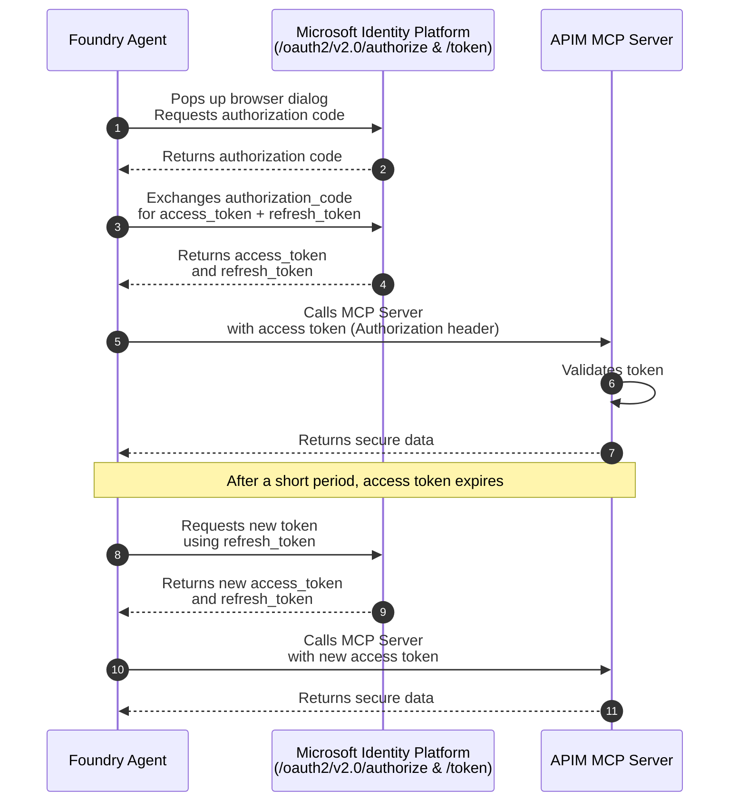

# Remote MCP with OAuth in Foundry v2

## Foundry Agent v2 Sample Code

```xml
    <PackageReference Include="Azure.AI.Projects" Version="1.2.0-beta.5" />
    <PackageReference Include="Azure.Identity" Version="1.17.1" />
    <PackageReference Include="Microsoft.Extensions.Configuration.Json" Version="10.0.1" />
```

### AppSettings.sample.json

```json
{
  "FoundryProject": {
    "URL": "<your foundry project url>",
    "ModelName": "<your deployment model in project>"
  },
  "MCPToolDefinition": {
    "Name" : "<tool name>",
    "URL": "<MCP Server endpoint url>",
    "ProjectConnectionId": "<connection id>"
  }
}
```

### Program.cs

```csharp
using Azure.AI.Projects;
using Azure.AI.Projects.OpenAI;
using Azure.Identity;
using Microsoft.Extensions.Configuration;
using OpenAI.Responses;
using System.Runtime.Versioning;
#pragma warning disable OPENAI001 // Type is for evaluation purposes only and is subject to change or removal in future updates

// create a record to hold all config for both foundry project and mcp tool definition
public record Config(
  string FoundryProjectURL,
  string FoundryProjectModelName,
  string MCPToolDefinitionName,
  string MCPToolDefinitionURL,
  string MCPToolDefinitionProjectConnectionId
);

public class Program
{
    [RequiresPreviewFeatures]
    public static async Task Main()
    {
        // Build configuration from appsettings.json
        var configuration = new ConfigurationBuilder()
            .SetBasePath(Directory.GetCurrentDirectory())
            .AddJsonFile("appsettings.json", optional: false, reloadOnChange: true)
            .Build();

        // Read values from configuration
        var config = new Config(
          configuration["FoundryProject:URL"] ?? throw new Exception("Missing FoundryProject:URL in appsettings.json"),
          configuration["FoundryProject:ModelName"] ?? throw new Exception("Missing FoundryProject:ModelName in appsettings.json"),
          configuration["MCPToolDefinition:Name"] ?? throw new Exception("Missing MCPToolDefinition:Name in appsettings.json"),
          configuration["MCPToolDefinition:URL"] ?? throw new Exception("Missing MCPToolDefinition:URL in appsettings.json"),
          configuration["MCPToolDefinition:ProjectConnectionId"] ?? throw new Exception("Missing MCPToolDefinition:ProjectConnectionId in appsettings.json")
        );

        AIProjectClient projectClient = new AIProjectClient(new Uri(config.FoundryProjectURL), new AzureCliCredential());

        // Prompt user for new agent name
        Console.WriteLine("Please provide new agent name:");
        var agentName = Console.ReadLine();

        McpTool tool = ResponseTool.CreateMcpTool(
            serverLabel: config.MCPToolDefinitionName,
            serverUri: new Uri(config.MCPToolDefinitionURL),
            toolCallApprovalPolicy: new McpToolCallApprovalPolicy(GlobalMcpToolCallApprovalPolicy.NeverRequireApproval)
        );
        
        tool.ProjectConnectionId = config.MCPToolDefinitionProjectConnectionId; // set this to the previously created OAuth2 connection

        PromptAgentDefinition agentDefinition = new(config.FoundryProjectModelName)
        {
            Instructions = "You are a Petstore Owner",
            Tools = { tool },
        };

        AgentVersion newAgentVersion = projectClient.Agents.CreateAgentVersion(agentName, options: new(agentDefinition));
        Console.WriteLine($"Created new agent version with ID: {newAgentVersion.Id}");
    }
}
```

## OAuth 2.0 authorization code flow


## Remote MCP Servers using APIMv2

### Key Capabilities

- Secure Gateway: APIM acts as an intelligent gateway, handling OAuth 2.0 Authorization Code Flow, authentication, and request routing.
- Monitoring & Observability: Integration with Azure Log Analytics and Application Insights enables deep visibility into API usage, performance, and errors.
- Policy Enforcement: APIM’s policy engine allows for custom rules, including token validation, header manipulation, and response transformation.
- Rate Limiting & Throttling: Built-in support for rate limits, quotas, and IP filtering helps protect backend services from abuse and ensures fair usage.
- Managed Identity & Entra ID: Secure service-to-service communication is enabled via system-assigned and user-assigned managed identities, with Entra ID handling identity and access management.
- Flexible Deployment: MCP servers can be hosted in Azure Functions, App Services, or Container Apps, and exposed via APIM with minimal changes to existing APIs.

## Azure Entra ID App Registrations

### Backend App Registration for API - APIM

- Expose an API -> Add a scope -> user_impersonation (Admins and users)
- App roles -> Create app role -> mcp.read (Both)


### Client App Registration for Client App - Foundry

- API permissions -> Add a permission -> Click Microsoft Graph -> "Delegated permissions" -> Select email, openid, profile
  - Make sure to Grant admin consent
- Certificates & secrets -> New client secret
- API permissions -> Add a permission -> My APIs -> select the Backend App registration
    - "Delegated permissions" -> select scope (user_impersonation) of backend app registration
    - "Application permissions" -> select app role (mcp.read) of backend app registration
- Grant Admin Consent!

## APIM MCP Server Inbound Policy

- Add an access restriction policy to the inbound policy:

    ```xml
    <validate-azure-ad-token tenant-id="entra-tenant-id" header-name="Authorization" failed-validation-httpcode="401" failed-validation-error-message="Unauthorized. Access token is missing or invalid.">     
        <client-application-ids>
            <application-id>your-client-application-id</application-id>
        </client-application-ids> 
    </validate-azure-ad-token>
    ```

## Foundry New 

### Connect a tool (MCP with OAuth Identity Passthrough)

- Name -> (this is the value needed later for the `appSettings.json` `ProjectConnectionId`)
- Remote MCP Server endpoint -> APIM MCP Server endpoint
- Client ID -> Client App Registration client ID
- Client Secret -> Client App Registration secret
- Token URL -> `https://login.microsoftonline.com/{entra-tenant-id}/oauth2/v2.0/token`
- Auth URL -> `https://login.microsoftonline.com/{entra-tenant-id}/oauth2/v2.0/authorize`
- Refresh URL -> `https://login.microsoftonline.com/{entra-tenant-id}/oauth2/v2.0/refresh`
- Scopes -> `.default`

## Resources

- [Foundry v2: Authentication support for the MCP tool](https://learn.microsoft.com/en-us/azure/ai-foundry/agents/how-to/mcp-authentication?view=foundry)
- [Remote MCP using Azure API Management](https://learn.microsoft.com/en-us/samples/azure-samples/remote-mcp-apim-functions-python/remote-mcp-apim-functions-python/)
- [Protect an API in APIM using OAuth w Entra ID](https://learn.microsoft.com/en-us/azure/api-management/api-management-howto-protect-backend-with-aad)
- [Microsoft Identity Platform and OAuth 2.0 authorization code flow](https://learn.microsoft.com/en-us/entra/identity-platform/v2-oauth2-auth-code-flow)
- [Deployment Guide Copilot Studio agent with APIM MCP Server OAuth 2.0](https://techcommunity.microsoft.com/blog/azure-ai-foundry-blog/deployment-guide-copilot-studio-agent-with-mcp-server-exposed-by-api-management-/4462432)
