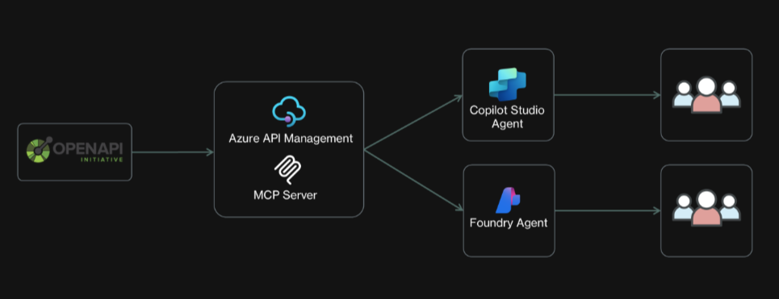

# Workshop Day: Step-by-Step Flow

## Architecture Diagram

We’ll show how to turn an existing REST API into an AI-accessible service using Azure API Management (APIM) and the Model Context Protocol (MCP). We’ll expose the public Petstore API via APIM’s v2 new MCP server feature, then demonstrate two consumption paths: a no-code Microsoft Copilot Studio agent (for “Maker” personas) and a code-based Microsoft Foundry agent (for developers). This approach lets any industry reuse existing APIs in AI solutions with minimal effort – saving development time and costs while leveraging Azure services. 

In short, this demo delivers a clear message: “Leverage what you already have, and let AI do more with it – securely, quickly, and at low cost, across any vertical.” 

## Step 1: Kickoff & Orientation

- Welcome participants, review objectives, and introduce the Foundry Agent, MCP, and APIM concepts.
- Share agenda and resources (whiteboard).

### [Prerequisites](APIM%20MCP%20Foundry%20Agent%20Prereq.md) 

## Step 2: Import & Expose API in APIM

- **Import REST API**: Use OpenAPI spec to import a your RESTful API into APIM.
- **Enable MCP Server**: In APIM, create an MCP server from the imported API. Select which operations to expose as MCP tools.
- **Optional: Leverage MCP Inspector to test the endpoint**: [MCP Inspector - Model Context Protocol](https://inspector.modelcontextprotocol.io)
- **Bonus: Configure Authentication**: Set up OAuth2 for secure access.

## Step 3: Build AI Agents

### Optional: Low-Code Path (Microsoft Copilot Studio)

- Create a Copilot Studio agent.
- Add the MCP server endpoint as a tool.
- Test agent.

### Code Path (Microsoft Foundry Agent)

- Leverage sample GitHub repository (Agent Framework, Foundry Agent).
- In VS Code, configure the agent to use the MCP server endpoint.
- Implement code to invoke MCP tools and process responses.
- Run code to create and test the agent.
- Access and test the newly created Foundry Agent via the Microsoft Foundry VSCode Extension.

## Step 4: Bonus: Secure & Monitor

- **Leverage OAuth (Token-based authentication)**: [Secure access to MCP servers in Azure API Management | Microsoft Learn](https://learn.microsoft.com/azure/api-management/secure-mcp-servers)
- **Entra ID App Registrations (client/server)**: [Authorize test console of API Management developer portal - OAuth 2.0 - Azure API Management | Microsoft Learn](https://learn.microsoft.com/azure/api-management/api-management-howto-oauth2)
- **Apply APIM Policies**: Set up rate limiting, logging, and monitoring via Application Insights.
- **Test Security**: Validate that only authorized users can access MCP tools.

## Step 5: Demo & Presentation

- Prepare a short demo showing both agent paths (Copilot Studio and Foundry).
- Present business impact: time saved, ease of integration, security, and scalability.

## Step 6: Wrap-Up & Next Steps

- Gather feedback, share lessons learned, and discuss how to take the solution forward (e.g., pilot, production, further experimentation).

---

## Workshop Timeline

| Phase                  | Duration | Activities                               |
|------------------------|----------|------------------------------------------|
| Kickoff                | 30 min   | Orientation, team formation              |
| API Import & MCP       | 1 hour   | Import API, enable MCP server            |
| Agent Build            | 2 hours  | Build Copilot Studio & Foundry agents    |
| Security & Testing     | 1 hour   | Configure policies, test endpoints       |
| Demo & Presentation    | 1 hour   | Prepare and deliver group demos          |
| Wrap-Up                | 30 min   | Feedback, next steps                     |
